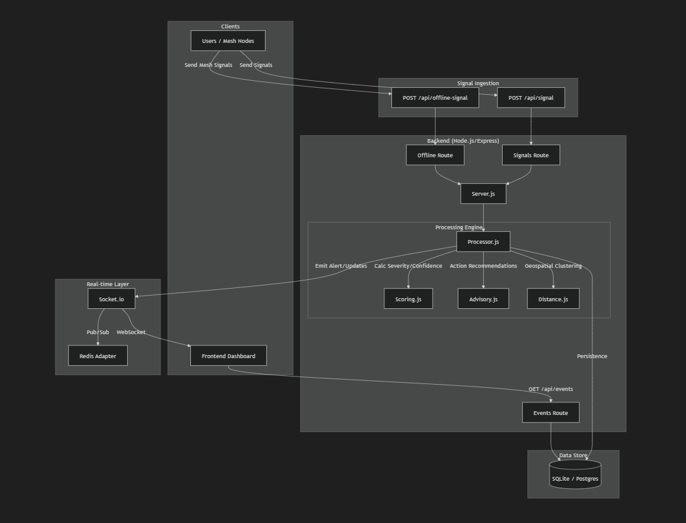

**SignalNet**

Real-Time Crisis Intelligence \& Dynamic Risk Zoning Engine

SignalNet is a real-time disaster intelligence system that ingests live multi-source signals, clusters anomalies spatially, calculates severity \& confidence scores, predicts stabilization ETA, and visualizes dynamic danger zones on an interactive map.

Built using:

Node.js (Backend)

Redis (Event streaming \& caching)

WebSockets (Real-time updates)

SQLite (Event persistence)

React + Leaflet (Frontend visualization)

Docker (Containerization)

📌 Problem Statement

During disasters:

Information is fragmented

Signals arrive from multiple unverified sources

Decision-makers lack severity prioritization

No predictive stabilization indicator exists

Result → Delayed and inefficient response.

💡 Solution

SignalNet:

✔ Ingests signals from social + sensor sources

✔ Clusters anomalies spatially

✔ Calculates severity \& confidence scores

✔ Tracks centroid drift (movement of danger zone)

✔ Predicts ETA to stabilization

✔ Streams real-time alerts

✔ Visualizes dynamic risk areas

🧠 Core Features

1️⃣ Dynamic Risk Zone

Red zone auto-expands for severity ≥ 7

Zone drifts based on centroid movement

Velocity color-coded (slow → fast)

2️⃣ Confidence Scoring

Based on:

Signal diversity

Signal consistency

Recency

Filters false positives

3️⃣ ETA Prediction Engine

Uses signal arrival rate

Severity trend slope

5-minute growth delta

Predicts minutes until stabilization

4️⃣ Real-Time Alerts

WebSocket-based streaming

Critical alerts auto-highlighted

Events resolvable from dashboard

5️⃣ Simulation Engine

Flood scenario generator

Movement drift triggers

Confidence test triggers

Database validation scripts

🏗 Architecture

&nbsp; 

Flow:

Signal Sources

→ Backend Ingestion

→ Clustering Engine

→ Severity + Confidence Model

→ ETA Predictor

→ Redis

→ WebSocket Broadcast

→ Frontend Dashboard

📂 Project Structure

backend/

&nbsp; engine/

&nbsp; node\_modules/

&nbsp; routes/

&nbsp; tests/

&nbsp; scripts/

frontend/

&nbsp; node\_modules/

&nbsp; dist/

&nbsp; src/

&nbsp; public/

demo\_tests/

assets/

⚙️ How To Run

**Backend**

cd backend

npm install

node server.js

**Frontend**

cd frontend

npm install

npm run dev

Redis (Docker)

docker run -d --name redis -p 6379:6379 redis

🎯 Future Improvements

Offline mesh-based emergency mode

ML-based anomaly scoring

Multi-city scalability

SMS / Automated leaflet dispatch

Government API integration

💼 Portfolio Context

This project demonstrates:

Distributed system design

Real-time event streaming

Spatial clustering logic

Risk modeling

Cloud-ready architecture

Production-level structuring

📸 Screenshots

(dashboard images here)

📜 License

MIT

